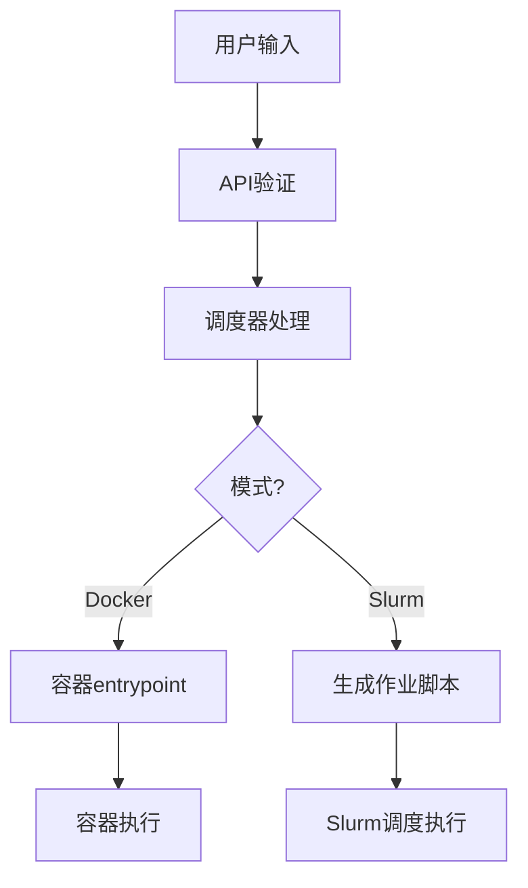
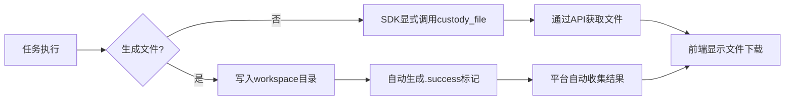

# Magnus平台技术解析笔记

## 一、入口命令（Entry Command）解析

### 1. 定义位置
```python
# 提交任务时的参数定义
class JobCreate:
    entry_command: str  # 例如 "python train.py"
    task_name: str
    namespace: str
    repo_name: str
```

### 2. 核心作用
- **容器启动**：Docker模式下作为容器入口命令
```python
def _submit_to_docker(...):
    subprocess.run(["docker", "run", "--entrypoint", entry_command, image])
```
- **Slurm作业**：HPC模式下生成Slurm作业脚本
```python
def _submit_to_slurm(...):
    wrapper_content = f"""#!/bin/bash
#SBATCH -J {job_name}
#SBATCH -o {output_path}

{entry_command}
"""
```

### 3. 安全限制
```yaml
# magnus_config.yaml中的安全设置
server:
  entry_command: "python"  # 默认限制
```

### 4. 使用示例
```python
submit_job(
    entry_command="python train.py --lr 0.001",
    task_name="实验1",
    ...
)
```

### 5. 生命周期


## 二、文件传输机制详解

### 1. 文件路径定义
```python
# 环境变量定义
MAGNUS_HOME = os.environ.get("MAGNUS_HOME", "/magnus")
WORKSPACE_DIR = os.path.join(MAGNUS_HOME, "workspace")
RESULT_FILE = os.path.join(WORKSPACE_DIR, ".magnus_result")
ACTION_FILE = os.path.join(WORKSPACE_DIR, ".magnus_action")
```

### 2. 文件回传方式

#### 2.1 标记文件自动生成
```bash
# 成功标记（必填）
echo "success" > $MAGNUS_HOME/workspace/.magnus_success

# 结果文件（可选）
echo "训练完成，模型保存在/models/experiment1/" > $MAGNUS_HOME/workspace/.magnus_result

# 动作指令（可选）
echo "notify:模型训练已完成" > $MAGNUS_HOME/workspace/.magnus_action
```

#### 2.2 SDK文件托管
```python
# 示例：上传训练日志
client.custody_file("training.log", expire_minutes=60)
```

#### 2.3 蓝图文件参数
```yaml
parameters:
  - key: dataset
    type: file_secret
    description: "训练数据集"
    default: "default_data.csv"
```

### 3. 文件传输流程


### 4. 实现步骤
1. **任务代码**：将生成文件保存到`$MAGNUS_HOME/workspace/`
2. **标记文件**：创建`.magnus_success`标记成功状态
3. **结果传递**：通过`.magnus_result`传递结构化结果
4. **动作指令**：使用`.magnus_action`触发后续操作
5. **SDK上传**：通过`custody_file`上传任意文件

### 5. 注意事项
- **文件大小限制**：单个文件<2G，总存储<10G
- **生命周期**：默认1小时，最大24小时
- **路径规范**：使用绝对路径`$MAGNUS_HOME/workspace/...`
- **并发控制**：最大128个并发文件操作

## 三、完整示例代码

### 1. 提交训练任务
```python
submit_job(
    task_name="实验1",
    entry_command="python train.py --lr 0.001",
    namespace="Rise-AGI",
    repo_name="my-project",
    branch="main",
    container_image="docker://pytorch/pytorch:2.5.1-cuda12.4-cudnn9-runtime",
    gpu_count=1,
    gpu_type="a100",
    cpu_count=4,
    memory_demand="8G"
)
```

### 2. 任务代码实现
```bash
#!/bin/bash
# train.py 示例
# 训练完成后生成结果文件
echo "模型保存路径: /models/experiment1" > $MAGNUS_HOME/workspace/.magnus_result
# 创建成功标记
echo "success" > $MAGNUS_HOME/workspace/.magnus_success
```

### 3. SDK文件上传
```python
# 上传训练日志
client.custody_file("training.log", expire_minutes=60)
# 上传模型文件
client.custody_file("model.pth", expire_minutes=1440, max_downloads=10)
```

### 4. 蓝图文件参数
```yaml
parameters:
  - key: dataset
    type: file_secret
    description: "训练数据集"
    default: "default_data.csv"
```

## 四、配置文件关键参数
```yaml
# magnus_config.yaml重要配置
server:
  cors_origins:
    - "http://your-server-ip:3011"
    - "http://localhost:3013"
  file_custody:
    max_size: 10G
    max_file_size: 2G
    default_ttl_minutes: 60
    max_ttl_minutes: 1440
